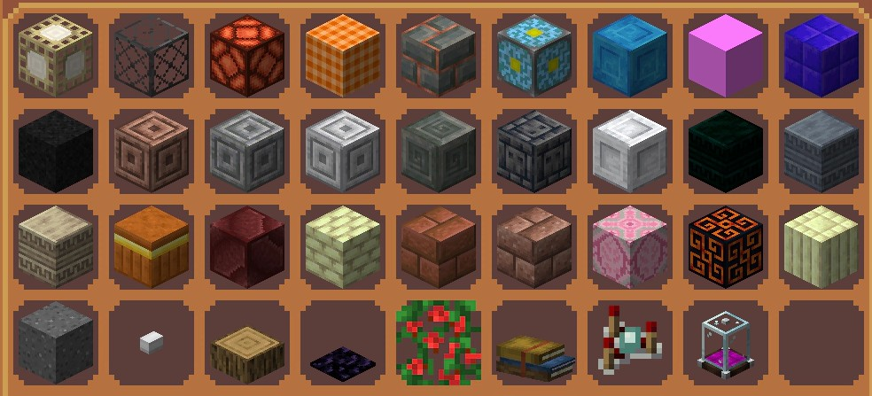

<!-- markdownlint-disable MD033 -->

# 开始

里吼阿，初次见面，请多指教！

云梦都是一个minecraft服务器，始于2017


## 玩法说明

### 目前拥有玩法

- 彩蛋战争
- 战桥
- 起床战争
- tntRUN
- 密室傻手
- 1.12.2老生存
- 1.21.8空岛

### 目前更新计划

- 将空岛升级到1.21.11
- 开设1.21.11生存
- 开设小游戏(小游戏派对and僵尸末日)
- 空岛附魔升级，增加200+全新附魔

::: info
您可以直接使用原版客户端进入云梦都，不需要任何额外 mod

当然，优化模组之类的不影响游戏玩法的也是没问题的
:::
___

## 主要玩法介绍

### 1.12.2生存

<sup>主条目：[1.12.2生存服](./surv_old)</sup>


- 最早开设的一个玩法之一，**直到今年已经开设了8年**，拥有玩法插件**粘液科技**
- 拥有大量老登遗迹，可以前来考古

### 1.21.8空岛

<sup>主条目：[1.21空岛服](./skyblock)</sup>


- 与1.12生存相反，空岛更加偏向原版，在原版基础上使用插件增加了一些装饰品

___

<div style="display:flex; gap:18px; justify-content:space-between; align-items:flex-start;">
  <div style="flex: 1 1 320px; min-width: 220px;">
    <p style="margin:2; font-size:20px;"><strong>更多方块</strong></p>
    <p style="margin:6px 0 0 0;">拥有700+全新方块，每种都不重样<br>风格多种多样任你随心搭配<br>从庭院到神社，从人里到红魔馆<br>每一处都能布置出独特氛围</p>
  </div>

  
</div>

___

___

<div style="display:flex; gap:16px; justify-content:space-between; align-items:flex-start;">
  <div style="flex: 1 1 320px;; min-width: 220px;">
    <p style="margin:2; font-size:20px;"><strong>全新的附魔系统</strong></p>
    <p style="margin:6px 0 0 0;">附魔台现在会给予更多更强力的附魔，让你的工具更加强大！</p>
  </div>

  
</div>

___

## 完善文档

:::info
文档可能有缺漏或不够完善之处，欢迎各位同好帮助完善文档
:::

[](https://github.com/MelodyYuuka/HifuuCraft-docs)

:::center

<VPCard
  title="HifuuCraft-docs"
  desc="云梦都 MC 帮助文档仓库"
  logo="/images/logo.webp"
  link="https://github.com/MelodyYuuka/HifuuCraft-docs"
  background="rgba(62, 175, 124, 0.15)"
/>

:::

如果对 [文档](https://github.com/MelodyYuuka/HifuuCraft-docs) 有更多补充或建议, 欢迎提 [issue](https://github.com/MelodyYuuka/HifuuCraft-docs/issues) 或 [Pull request](https://github.com/MelodyYuuka/HifuuCraft-docs/pulls)

::: code-tabs#shell

@tab:active pnpm

```bash:no-line-numbers
git clone https://github.com/MelodyYuuka/HifuuCraft-docs
# 拉取源码

cd HifuuCraft-docs/docs

pnpm install
# 安装依赖

pnpm docs:dev
# 开始写作
```

@tab npm

```bash:no-line-numbers
git clone https://github.com/MelodyYuuka/HifuuCraft-docs
# 拉取源码

cd HifuuCraft-docs/docs

npm install
# 安装依赖

npm run docs:dev
# 开始写作
```

:::

:::tip
更多可见 [文档贡献指南](../about/contribute/zh_style.md)
:::
